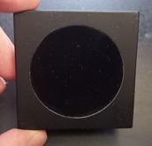

# OAM-TouchRound

OpenKNX Firmware und Anwendung zur OpenKNX-kompatiblen Einbindung von runden Touch-Displays.

## Anwendungszwecke

Folgende Geräte können gesteuert werden:

- Ein- Ausschaltbares Gerät 
- Steckdose
- Lampe
- Jalousie
- Rolladen
- Markise
- Thermostat
- Anzeige
- Alam
- Lüfter
- Fenster
- Tür
- Garagentor
- Szene
- Mediensteuerung

Die gesamte Konfiguration erfolgt über die ETS.
Zusätzlich gibt es die Möglichkeit Benutzerspezifische Bildsymbole auf das Gerät zu laden.

Mehr Information über die Konfiguration sind in der [Applikationsbeschreibung](doc/Applikationsbeschreibung.md) zu finden.

## Kompatible Displays

Aktuell wird folgendes Touch-Display unterstützt:
- Seeed Studio Round Display for XIAO

Weitere Touch-Displays können bei Bedarf angebunden werden.

## Kompatible Hardware

Die kompakte Steuerplatine kann optional vollständig in ein Standard-Schalterprogramm integriert werden. Hier als Beispiel mit Gira-Schalterprogramm in matt schwarz:

<kbd></kbd>

Dabei ist lediglich eine Einbautiefe von ca. 2 cm in einer Standard-60-mm-Unterputzdose erforderlich.

Alle Infos zur kompatiblen Hardware findet sich [hier](https://www.ab-smarthouse.com/produkt/openknx-touch-display/) oder bei Interesse einfach Kontakt per [E-Mail](mailto:info@ab-smarthouse.com?subject=[OpenKNX]%20Touch%20Round) aufnehmen.